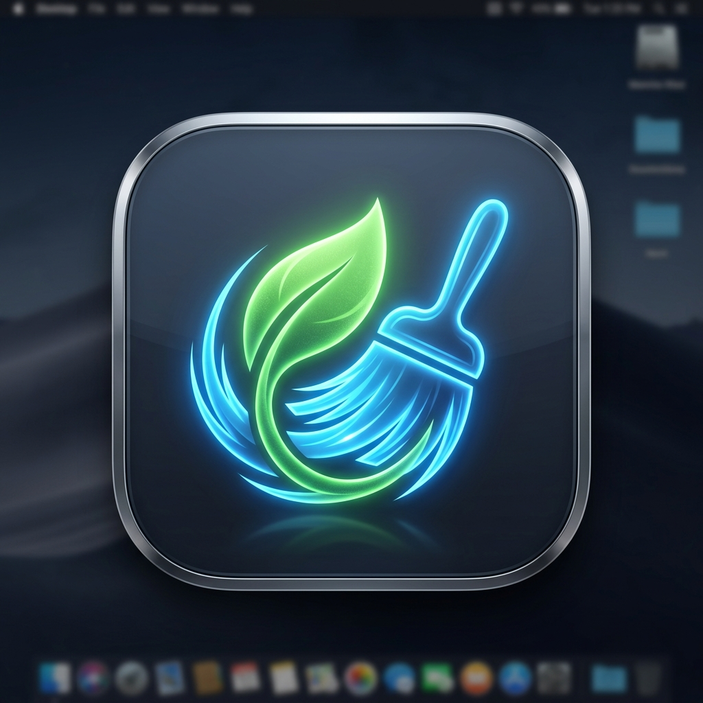

# MacCleaner (Native SwiftUI App)

A premium, native macOS desktop cleanup utility built using **Swift** and **SwiftUI**. This utility allows developers and power users to scan, analyze, filter, and clean up local caches, logs, trash, developer junk, and custom directories (including hidden files).

<p align="center">
  
</p>

---

## Key Features

- **Enhanced HUD Home Dashboard**: Features interactive grid cards for each cleanup category, live-updated scan stats, a circular progress gauge, hover scaling glows, and smooth transitions.
- **Project Builds Scanner**: Scans local workspaces (`~/Desktop`, `~/Documents`, `~/Projects`, `~/Workspace`, `~/src`) up to 3 levels deep to locate and delete build folders in **Flutter** (`build/`, `.dart_tool/`), **Node.js** (`node_modules/`, `.next/`, `dist/`), **Gradle** (`build/`), and **Swift Package Manager** (`.build/`).
- **Developer-Focused Cleaning**: Built-in support for cleaning massive developer caches:
  - **Xcode DerivedData** (`~/Library/Developer/Xcode/DerivedData`)
  - **Gradle Caches** (`~/.gradle/caches`)
  - **Android Caches** (`~/.android/cache` and Android Studio versioned caches in `~/Library/Caches/Google/AndroidStudio*`)
- **System Junk & Caches**: Targets user caches (`~/Library/Caches`), system caches (`/Library/Caches`), user logs (`~/Library/Logs`), and System Trash (`~/.Trash`).
- **Custom Directory Deep-Scanner**: Select any folder on your Mac (e.g. project directory, downloads folder) to run a recursive scan listing **all files** and **hidden files** (such as `.DS_Store`, `.env`, `.git` folders, etc.).
- **Selective Deletion**: Checkbox-based list view with quick selection filters:
  - `Select All` / `Deselect All`
  - `Select Hidden Files Only`
  - `Select Visible Files Only`
- **Safe Cleaning Options**: Support for moving items safely to the Trash or permanently deleting them based on your preference.
- **Process Console Log**: A high-tech, real-time scrolling console showing the precise files being scanned or deleted.

---

## Technical Architecture

The project is built entirely on macOS native APIs without external package dependencies:

- **[main.swift](main.swift)**: The entry point of the SwiftUI application. Initializes the application state and window group.
- **[Views.swift](Views.swift)**: Implements the GUI components: sidebar layout, circular progress trackers, clean success sheets, scrollable logs console, and detailed checkbox lists. Includes a `VisualEffectView` wrapper for macOS native window vibrancy (glassmorphism).
- **[AppModel.swift](AppModel.swift)**: Tracks observable UI states, coordinates background scanning/deletion tasks on separate dispatch threads, and hosts the folder picker trigger.
- **[Scanner.swift](Scanner.swift)**: The core scanning engine. Traverses directory trees recursively, calculates directory sizes, separates hidden files, and executes deletion processes.
- **[Info.plist](Info.plist)**: Defines application bundle properties.
- **[build.sh](build.sh)**: Executable build script compiling and packaging the app.

---

## Building and Running

You can compile and launch the application using standard terminal commands.

### 1. Compile the App Bundle
Ensure Xcode Command Line Tools are installed, then run the compilation script:
```bash
./build.sh
```
This compiles the source files using `swiftc` and bundles them into `MacCleaner.app`.

### 2. Launch the Application
Run the packaged app bundle from the command line:
```bash
open MacCleaner.app
```
Alternatively, double-click the **`MacCleaner`** application icon in Finder inside this directory.
